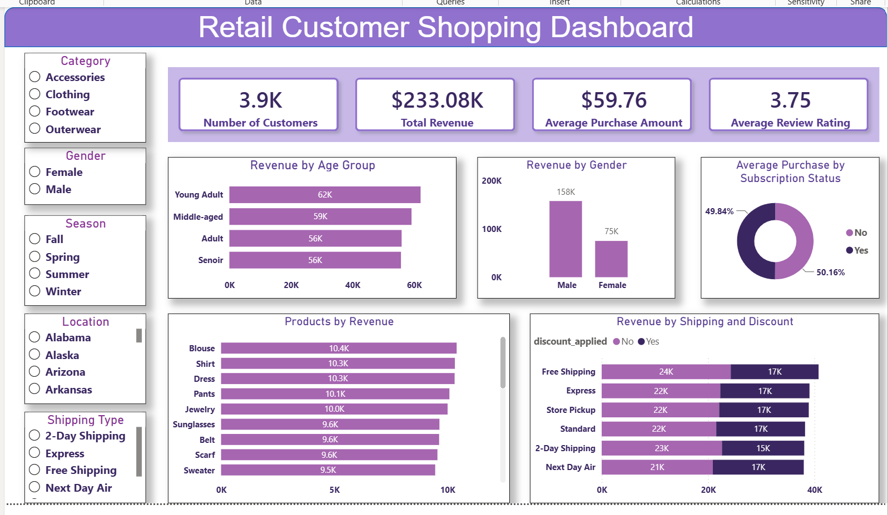

# 🛍️ Retail Customer Shopping Behavior Analysis

An end-to-end retail analytics project using Python, PostgreSQL, SQL, and Power BI to analyze customer shopping behavior and generate actionable business insights.

## 📊 Project Snapshot

**Domain:** Retail Analytics

**Tools:** Python, Pandas, PostgreSQL, SQL, Power BI

**Dataset:** Customer Shopping Trends Dataset

**Project Type:** End-to-End Data Analytics

**Dashboard:** Interactive Power BI Dashboard

## 📌 Project Overview

This project analyzes customer shopping behavior in a retail store using Python, PostgreSQL, SQL, and Power BI. The objective is to uncover purchasing patterns, customer demographics, product performance, and shipping preferences to support data-driven business decisions.

The project follows a complete data analytics workflow, including data cleaning, feature engineering, SQL-based business analysis, and interactive dashboard development.

## 🎯 Objectives

- Analyze customer purchasing behavior.
- Identify high-revenue customer segments.
- Evaluate product and category performance.
- Examine the impact of discounts and shipping methods on revenue.
- Build an interactive dashboard for business decision-making.

---

## 🛠️ Tech Stack

- Python
- Pandas
- NumPy
- PostgreSQL
- SQL
- Power BI

---

## 📂 Project Workflow

```
Customer Dataset
        │
        ▼
Data Cleaning & Feature Engineering (Python)
        │
        ▼
Data Storage (PostgreSQL)
        │
        ▼
Business Analysis (SQL)
        │
        ▼
Interactive Dashboard (Power BI)
```

---

## 📊 Data Preparation

### Data Cleaning
- Removed duplicate records.
- Standardized column names.
- Handled missing values.
- Corrected data types.

### Feature Engineering
- Created Age Group from customer age.
- Converted purchase frequency into numerical values.
- Created additional analytical columns for reporting.

---

## 🗄️ SQL Analysis

Business questions explored include:

- Revenue by gender
- Revenue by age group
- Average purchase amount by subscription status
- Top revenue-generating products
- Revenue by shipping type
- Revenue by discount usage
- Customer segmentation based on purchase history
- Product performance analysis
- Repeat customer analysis

---

## 📈 Power BI Dashboard

The interactive dashboard provides insights into:

- Total Customers
- Total Revenue
- Average Purchase Amount
- Average Review Rating
- Revenue by Age Group
- Revenue by Gender
- Average Purchase by Subscription Status
- Top Revenue-Generating Products
- Revenue by Shipping Type and Discount

---

## 💡 Key Business Insights

- Young Adult customers generated the highest revenue.
- Male customers contributed a larger share of total revenue.
- Blouse, Shirt, Dress, Pants, and Jewelry were the top-performing products.
- Average purchase amount was nearly the same for subscribers and non-subscribers.
- Free Shipping generated the highest revenue among shipping methods.
- Discounts significantly influenced revenue across shipping options.

---

## 📷 Dashboard Preview



---

## 📁 Project Structure

```text
Retail-Customer-Shopping-Behavior-Analysis/
│
├── README.md
├── Retail_Customer_Analysis.ipynb
├── Retail_SQL_Queries.sql
├── Retail_Customer_Shopping_Dashboard.pbix
├── customer.csv
├── dashboard.png
├── .gitignore
└── LICENSE
```

---

## 🚀 Future Improvements

- Develop customer segmentation using RFM Analysis.
- Predict customer spending using machine learning.
- Publish the dashboard using Power BI Service.
- Create additional drill-through report pages.

---

## 👩‍💻 Author

**Anjali Kumari**

If you found this project helpful, feel free to ⭐ the repository.
